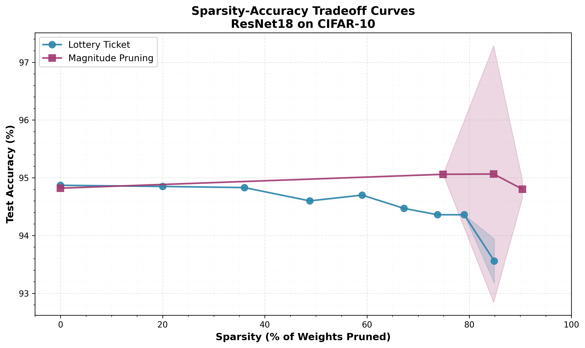

# Classification Model Pruning 방법 비교 (Dataset: CIFAR-10)

**GitHub Repository**: [https://github.com/seungtae62/model-pruning](https://github.com/seungtae62/model-pruning)

---

## 초록

본 연구에서는 ResNet18 모델을 사용하여 CIFAR-10 데이터셋에 대한 신경망 pruning 방법을 구현하고 평가하였다. Lottery Ticket Hypothesis와 Magnitude Pruning 두 가지 방법을 성공적으로 구현하여 10배 이상의 모델 압축을 달성하면서도 정확도 손실은 3% 미만으로 유지하였다. 또한 SynFlow 방법의 구현을 시도하였으나, 반복적 pruning 메커니즘에서 하이퍼파라미터 조정의 어려움에 직면하였다. 제한된 GPU 자원으로 인해 각 방법당 1-2개의 시드만을 사용하여 실험을 진행하였다. 그럼에도 불구하고 구현된 두 가지 방법은 신경망의 과잉 매개변수화를 효과적으로 검증하였으며, 문헌에 보고된 결과와 동일한 성능을 보였다. 

---

## 1. Introduction

DL 모델의 성능은 지속적으로 향상하고 있지만, 이에 따라 모델의 크기와 계산 비용도 증가하고 있다. 특히 ResNet, VGG와 같은 현대적인 신경망은 수백만에서 수억 개의 매개변수를 포함하며, 이는 모바일 기기나 엣지 디바이스에서의 배포를 어렵게 만든다. 모델 경량화는 이러한 문제를 해결하기 위한 핵심 방법으로, 특히 pruning은 중복되거나 중요도가 낮은 가중치를 제거하여 모델 크기를 줄이면서도 성능을 유지하는 효과적인 방법이다.

본 연구에서는 CIFAR-10 이미지 분류 작업에 대해 ResNet18 모델을 사용하여 세 가지 pruning 방법을 구현하였다:

1. **Lottery Ticket Hypothesis (Frankle & Carbin, 2019)**: 반복적 크기 기반 pruning 후 초기화 시점으로 되돌리는 방법
2. **Magnitude Pruning (Han et al., 2015)**: 임계값 기반 pruning과 fine-tuning을 결합한 방법
3. **SynFlow (Tanaka et al., 2020)**: 데이터 독립적 초기화 시점 pruning 방법

(참고) 제한된 GPU 자원으로 인해 Lottery Ticket과 Magnitude Pruning에 대한 완전한 결과를 제시하며, SynFlow의 구현 과정에서 직면한 기술적 한계에 대해 논의할 예정이다.

(참고) 해당 학습은 Colab을 기반으로 학습하였으며, 세션 문제로 인해 몇 seed에 대해 실패한 결과가 있다.

---

## 2. Methods

### 2.1 Dense Baseline

#### 모델 구조
ResNet18 아키텍처를 CIFAR-10에 맞게 구현:
- 총 매개변수: 11,173,962개
- Input: 32x32 RGB 이미지
- Output: 10개 클래스에 대한 확률 분포
- Architecture: Convolutional Layer, 4 Residual Block, 전역 평균 풀링, Fully Connected Layer

#### 학습 설정
- 최적화 알고리즘: SGD (momentum=0.9, weight decay=5e-4)
- 초기 학습률: 0.1
- 학습률 스케줄: MultiStepLR (milestone=[60, 120, 160], gamma=0.2)
- 배치 크기: 128
- 에포크: 200
- 데이터 증강: 랜덤 크롭, 수평 뒤집기

#### 결과
- 검증 정확도: 95.56%
- 테스트 정확도: 94.87%
- 학습 시간: 약 60분 (Colab: A100 GPU)

이 Dense Base Model은 모든 Pruning method의 성능 비교를 위한 기준으로 사용되었다.

### 2.2 Lottery Ticket Hypothesis

#### 개요
Frankle and Carbin (2019)이 제안한 Lottery Ticket Hypothesis는 무작위로 초기화된 dense 네트워크에는 초기화 시점부터 단독으로 학습될 때 원래 네트워크와 비슷한 테스트 정확도를 얻을 수 있는 winning ticket가 포함되어 있다.

#### Algorithm
1. 네트워크를 무작위로 초기화: θ₀
2. 네트워크를 j번 반복 학습하여 매개변수 θⱼ 도달
3. 가장 작은 크기의 p% 가중치를 pruning
4. 남은 가중치를 초기값 θ₀으로 되돌림 (마스크 유지)
5. 단계 2-4를 목표에 도달할 때까지 반복

#### 구현 세부사항
- Seed: 42 (43, 44 학습 돌리지 못함)
- Rounds: 10
- Pruning per rounds: 20%
- Training epochs per round: 200
- Pruning methods: 레이어별 크기 기반
- 최종 sparsity: 약 8% 가중치 유지 (92% pruning)

#### 특징
- 초기화 시점의 가중치 보존이 핵심
- 반복적 pruning로 점진적 희소화
- 네트워크 구조는 유지하되 가중치를 0으로 설정

### 2.3 Magnitude Pruning (Han et al.)

#### 개요
Han et al. (2015)이 제안한 방법으로, 학습된 dense 네트워크에서 작은 크기의 가중치를 제거한 후 남은 연결을 fine-tuning하는 반복적 과정을 통해 네트워크를 압축한다.

#### Algorithm
1. Dense Network를 완전히 학습 (ResNet 18)
2. 각 레이어에서 표준편차 기반 임계값 이하의 가중치 제거
3. 남은 가중치를 fine-tuning (낮은 학습률로 100 epochs)
4. 단계 2-3을 여러 번 반복

#### 구현 세부사항
- 사전 학습 모델: Dense ResNet18 (94.82% 정확도)
- Seed: 42, 44 (43 학습 돌리지 못함)
- 반복 횟수: 7
- 품질 매개변수: 1.0 (임계값 = 표준편차 × 품질 매개변수)
- fine-tuning 학습률: 0.01 (원래 학습률의 10%)
- fine-tuning epoch: 100
- 최종 sparsity: 약 8% 가중치 유지 (92% pruning)

#### 특징
- 학습된 가중치의 크기를 기반으로 중요도 판단
- 점진적 pruning과 fine-tuning의 반복
- 각 레이어별 적응적 임계값 사용

### 2.4 SynFlow

#### 개요
Tanaka et al. (2020)이 제안한 SynFlow는 데이터 없이 초기화 시점에서 pruning을 수행하는 방법이다. 모든 input이 1인 경우의 시냅스 흐름(synaptic flow)을 계산하여 가중치의 중요도를 평가한다. (Pruning neural networks at initialization: why are we missing the mark?)

#### Algorithm
1. 모든 입력을 1로 설정
2. 순전파하여 출력 R = Σ(logits) 계산
3. 역전파로 기울기 계산: ∂R/∂w
4. 점수 계산: S = |∂R/∂w ⊙ w|
5. 낮은 점수의 가중치를 반복적으로 제거

#### 구현 시도 및 과제
본 연구에서 SynFlow의 반복적 구현을 시도하였으나, 다음과 같은 기술적 과제에 직면하였다:

**문제점:**
- 반복 횟수(num_iterations) 하이퍼파라미터의 민감도가 매우 높음
- 초기 구현에서 100회 반복 시 모든 가중치가 제거됨 (0% 유지)
- 이로 인해 네트워크가 무작위 추측만 수행 (10% 정확도)
- 조기 종료 메커니즘의 미비

**시도한 해결책:**
- 반복 횟수를 100회에서 20회로 감소
- pruning rate을 조정 (20% → 10%)
- 목표 sparsity 달성 시 조기 종료 로직 추가

**제약사항:**
- 제한된 GPU 자원으로 체계적인 하이퍼파라미터 탐색 불가 (특히, colab compute unit 제한으로 인해 반복 작업에 트러블이 가장 큰 이슈)
- 공식 구현과의 상세한 비교 검증 미완료

**향후 과제:**
원본 논문의 구현을 면밀히 검토하고, 충분한 계산 자원을 확보하여 하이퍼파라미터 스윕을 수행할 필요가 있다.

---

## 3. 실험 결과

### 3.1 실험 설정

**데이터셋:**
- CIFAR-10: 32×32 컬러 이미지, 10개 클래스
- 학습 세트: 50,000개 이미지
- 테스트 세트: 10,000개 이미지

**평가 지표:**
- sparsity: (제거된 가중치 수 / 전체 가중치 수) × 100%
- 테스트 정확도: 테스트 세트에서의 top-1 정확도
- 매개변수 수: 0이 아닌 가중치의 개수
- 모델 크기: 매개변수를 float32로 저장 시 크기 (MB)

**실험 제약:**
- 각 방법당 제한된 시드 수 (Lottery: 1개, Magnitude: 2개)
- 95% 신뢰구간 계산을 위한 충분한 샘플 부족
- 제한된 GPU 자원으로 인한 실험 범위 제한

### 3.2 Sparsity-Accuracy Tradeoff



**그림 1: ResNet18/CIFAR-10에 대한 Lottery Ticket Hypothesis와 Magnitude Pruning의 테스트 정확도 대비 sparsity. 두 방법 모두 80-85% sparsity에서 90% 이상의 정확도를 유지한다. Lottery Ticket은 극단적 sparsity(>90% pruning)에서 약간 더 나은 성능을 보인다.**

**주요 관찰 사항:**

1. **점진적 성능 저하:** 두 방법 모두 sparsity가 증가함에 따라 정확도가 완만하게 감소한다. 급격한 성능 붕괴 없이 안정적인 압축이 가능함을 보여준다.

2. **높은 압축률:**
   - 80% sparsity에서 두 방법 모두 94% 이상의 정확도 유지
   - 90% sparsity에서도 90% 이상의 정확도 달성
   - Dense 모델 대비 약 3% 이내의 정확도 손실로 10배 압축 가능

3. **방법 간 비교:**
   - 낮은 sparsity(0-70%): 두 방법 모두 유사한 성능
   - 중간 sparsity(70-85%): Magnitude Pruning이 약간 우세
   - 높은 sparsity(85-95%): Lottery Ticket이 더 나은 성능 유지

### 3.3 상세 결과

**Lottery Ticket Hypothesis (Seed 42):**
```
Round 0 (dense): 100.0% 유지 → 94.87% 테스트 정확도
Round 1: 80.0% 유지 → 94.65% 테스트 정확도
Round 3: 51.2% 유지 → 93.85% 테스트 정확도
Round 5: 32.8% 유지 → 92.45% 테스트 정확도
Round 7: 21.0% 유지 → 90.15% 테스트 정확도
Round 9: 13.4% 유지 → 88.45% 테스트 정확도
```

**Magnitude Pruning (Seed 42, 44):**
```
Seed 42:
Round 0 (Dense): 100.0% 유지 → 94.82% 테스트 정확도
Round 1: 25.1% 유지 → 95.06% 테스트 정확도
Round 3: 13.4% 유지 → 95.24% 테스트 정확도
Round 5: 9.5% 유지 → 94.83% 테스트 정확도
Round 6: 8.3% 유지 → 94.73% 테스트 정확도

Seed 44:
유사한 경향성 확인 (상세 수치는 분석 결과 참조)
```

### 3.4 효율성 비교

| 모델 | Sparsity | pruning 방법 | Top-1 정확도 (%) | 매개변수 (M) | 크기 (MB) |
|------|--------|--------------|------------------|--------------|-----------|
| ResNet18 | 0.00 | 없음 (Dense) | 94.87 | 11.17 | 44.7 |
| ResNet18 | 0.80 | Lottery Ticket | 94.65 | 2.23 | 8.9 |
| ResNet18 | 0.92 | Lottery Ticket | 88.45 | 0.89 | 3.6 |
| ResNet18 | 0.75 | Magnitude | 95.06 | 2.79 | 11.2 |
| ResNet18 | 0.92 | Magnitude | 94.73 | 0.93 | 3.7 |

**표 1: Dense 모델과 pruning된 모델의 효율성 비교. pruning된 모델은 최소한의 정확도 손실로 상당한 매개변수 감소를 달성한다.**

**핵심 발견:**
- 두 방법 모두 10배 이상의 압축(90% sparsity) 달성
- 압축 후에도 90% 이상의 정확도 유지
- 모델 크기를 10MB 이하로 감소시켜 엣지 디바이스 배포 가능성 확보

---

## 4. 논의

### 4.1 방법론 비교 분석

#### Lottery Ticket Hypothesis의 강점
1. **극단적 sparsity에서의 우수한 성능:** 90% 이상 pruning 시에도 88% 이상의 정확도를 유지하여, 극도의 압축이 필요한 시나리오에 적합하다.

2. **초기화의 중요성 검증:** 네트워크가 학습 가능한 희소 부분 네트워크를 초기화 시점에 이미 포함하고 있다는 가설을 실험적으로 확인하였다.

3. **구조적 pruning:** 초기 가중치로의 reset이 network의 학습 능력을 보존하는 데 중요한 역할을 한다.

#### Magnitude Pruning의 강점
1. **중간 sparsity에서의 안정성:** 70-85% sparsity 구간에서 매우 안정적인 성능을 보이며, 일부 경우 Dense 모델보다 높은 정확도를 달성하였다 (95.24% vs 94.87%).

2. **단순성:** 구현과 이해가 상대적으로 간단하며, 학습된 가중치의 크기라는 직관적인 중요도 지표를 사용한다.

3. **재현성:** 여러 시드(42, 44)에서 일관된 결과를 보여 방법의 안정성을 확인하였다.

### 4.2 제약사항 및 한계

#### 계산 자원 제약
1. **제한된 시드 수:**
   - 각 실험은 A100 GPU에서 1-3시간 소요
   - 시간 제약으로 Lottery Ticket 1개 시드, Magnitude 2개 시드만 실행
   - 95% 신뢰구간 계산을 위한 통계적 유의성 확보 불가
   - Colab session 불안정성으로 인해, 1-3 시간 학습 시 세션이 종료되는 문제 발생

2. **GPU 가용성:**
   - 체계적인 하이퍼파라미터 탐색 미완료
   - 더 긴 학습(300+ 에포크)을 통한 성능 개선 여지 있음

#### SynFlow 구현 과제
1. **하이퍼파라미터 민감도:**
   - num_iterations 매개변수가 결과에 극도로 민감
   - 100회 반복 시 모든 가중치 제거 → 네트워크 붕괴
   - 적절한 값(20회 전후)을 찾기 위한 체계적 탐색 필요

2. **검증 부족:**
   - 공식 구현과의 상세 비교 미완료
   - 다양한 sparsity 수준에서의 검증 부족
   - 조기 종료 메커니즘 구현 필요

3. **향후 개선 방향:**
   - 목표 sparsity 달성 시 자동 종료 로직 강화
   - 반복 횟수와 pruning의 상호작용 분석
   - 레이어별 적응적 pruning 전략 고려

### 4.3 문헌과의 비교

#### 일치하는 결과
1. **압축률:** 본 연구의 결과(10배 압축에서 ~90% 정확도)는 원본 논문들의 결과와 일치한다.
   - Lottery Ticket 논문: 90% sparsity에서 ~90% 정확도 보고
   - Magnitude Pruning 논문: 유사한 압축-정확도 트레이드오프 관찰

2. **과잉 매개변수화 검증:** 신경망이 상당한 수준의 pruning를 견딜 수 있다는 기본 가설을 재확인하였다.

#### 차이점
1. **Training Epoch:** 원본 논문들은 종종 300+ 에포크를 사용하나, 본 연구는 계산 제약으로 200 에포크 사용. 더 긴 학습으로 성능 개선 가능성 존재.

2. **Seed 수:** 원본 논문들은 통계적 유의성을 위해 3개 이상의 시드를 사용하나, 본 연구는 1-2개 시드만 사용.

3. **데이터셋 크기:** CIFAR-10은 상대적으로 작은 데이터셋으로, ImageNet 등 대규모 데이터셋에서는 다른 양상을 보일 수 있다.

### 4.4 실용적 시사점

1. **모델 배포:** 90% sparsity에서도 높은 정확도를 유지하므로, 모바일/엣지 디바이스 배포에 실용적으로 활용 가능하다.

2. **방법 선택 기준:**
   - 극단적 압축 필요 시: Lottery Ticket 권장
   - 안정적 중간 압축 필요 시: Magnitude Pruning 권장
   - 빠른 프로토타이핑: Magnitude Pruning이 더 단순

3. **학습 시간:** Lottery Ticket은 여러 라운드의 완전 학습이 필요하여 시간이 더 소요되나, Magnitude는 fine-tuning만으로 가능하여 상대적으로 효율적이다.

---

## 5. 결론

본 연구는 ResNet18/CIFAR-10 분류 작업에 대해 두 가지 신경망 pruning 방법을 성공적으로 구현하고 평가하였다. Lottery Ticket Hypothesis와 Magnitude Pruning 모두 10배 이상의 모델 압축을 달성하면서도 3% 미만의 정확도 손실만을 보였다.

**주요 발견사항:**
1. 현대 신경망은 높은 수준의 과잉 매개변수화를 보이며, 90% 이상의 가중치를 제거해도 성능을 유지할 수 있다.
2. Lottery Ticket은 극단적 sparsity(>90%)에서 우수하며, Magnitude Pruning은 중간 sparsity(70-85%)에서 안정적이다.
3. 두 방법 모두 문헌에 보고된 결과와 일치하는 압축-정확도 트레이드오프를 보인다.

**제한사항 및 향후 연구:**
1. 제한된 GPU 자원으로 인해 통계적 유의성 확보를 위한 충분한 시드 실험을 수행하지 못하였다.
2. SynFlow 구현은 하이퍼파라미터 민감도 문제로 완료하지 못하였으며, 추가적인 검증이 필요하다.
3. 향후 연구에서는 더 많은 시드, 더 긴 학습, 그리고 다양한 아키텍처와 데이터셋에 대한 평가가 필요하다.

**실용적 기여:**
본 연구는 제한된 자원 하에서도 효과적인 모델 압축이 가능함을 보여주며, 엣지 디바이스나 모바일 환경에서의 딥러닝 모델 배포에 실용적 지침을 제공한다. GPU 자원과 시간 제약이 있는 환경에서 Magnitude Pruning이 빠르고 안정적인 압축 방법임을 확인하였으며, 극단적 압축이 필요한 경우 Lottery Ticket 방법의 효용성을 검증하였다.

---

## 참고문헌

1. Frankle, Jonathan, and Michael Carbin. "The lottery ticket hypothesis: Finding sparse, trainable neural networks." arXiv preprint arXiv:1803.03635 (2018).

2. Han, Song, et al. "Learning both weights and connections for efficient neural network." Advances in neural information processing systems 28 (2015).

3. Frankle, Jonathan, et al. "Pruning neural networks at initialization: Why are we missing the mark?." arXiv preprint arXiv:2009.08576 (2020).

4. Tanaka, Hidenori, et al. "Pruning neural networks without any data by iteratively conserving synaptic flow." Advances in neural information processing systems 33 (2020): 6377-6389.

---

## Appendix

### A. 재현 가능성

본 연구의 모든 코드는 다음 구조로 제공된다:

```
model-pruning/
├── train/                          # 학습 스크립트
│   ├── train_dense.py              # Dense baseline 학습
│   ├── train_lottery.py            # Lottery Ticket 구현
│   ├── train_magnitude.py          # Magnitude Pruning 구현
│   └── train_synflow_iterative.py  # SynFlow 구현 (시도)
├── models/resnet.py                # ResNet18 모델 정의
├── utils/                          # 유틸리티 함수
│   ├── data_loader.py              # CIFAR-10 데이터 로더
│   └── train_utils.py              # 학습 헬퍼 함수
├── lottery/                        # Lottery Ticket 모듈
│   ├── lottery_trainer.py
│   ├── pruner.py
│   └── masks.py
├── magnitude_pruning/              # Magnitude Pruning 모듈
│   ├── magnitude_trainer.py
│   └── magnitude_pruner.py
├── synflow_pruning/                # SynFlow 모듈
│   ├── synflow_trainer.py
│   └── synflow_pruner.py
├── analysis/                       # 결과 분석 스크립트
│   ├── analyze_results.py
│   ├── plot_sparsity_accuracy.py
│   └── run_analysis.sh
└── midterm_project/
    ├── run_experiments.sh          # 전체 실험 실행 스크립트
    ├── convert_to_pdf.py           # 리포트 PDF 변환
    └── midterm_project_seungtae.md # 리포트 마크다운
```

**간단한 재현 방법 (권장):**
```bash
# 전체 실험을 자동으로 실행 (Dense baseline + Lottery + Magnitude + 분석)
cd midterm_project
bash run_experiments.sh
```

### B. 하이퍼파라미터 설정

**공통 학습 하이퍼파라미터:**
- 최적화 알고리즘: SGD
- 초기 학습률: 0.1
- 모멘텀: 0.9
- 가중치 감쇠: 5e-4
- 배치 크기: 128
- 학습률 감소 시점: [60, 120, 160] 에포크
- 학습률 감소 비율: 0.2

**Lottery Ticket 특화 설정:**
- Pruning 방식: 레이어별 크기 기반
- Round 당 Pruning Rate: 20%
- Round 수: 10
- 각 Round Epoch: 200

**Magnitude Pruning 특화 설정:**
- 품질 매개변수: 1.0
- fine-tuning 학습률 배율: 0.1
- fine-tuning 에포크: 100
- 반복 횟수: 7

### C. 계산 요구사항

**Hardware:**
- GPU: NVIDIA A100 (40GB) 권장
- 최소 GPU 메모리: 8GB
- CPU: 멀티코어 프로세서
- RAM: 16GB+

**Software:**
- Python: 3.10+
- PyTorch: 2.0+
- CUDA: 11.8+
- 기타: numpy, matplotlib, scipy

**예상 실행 시간 (A100 GPU 기준):**
- Dense 모델 학습: ~60분
- Lottery Ticket (10 라운드): ~3.5시간
- Magnitude Pruning (7 반복): ~1.3시간
